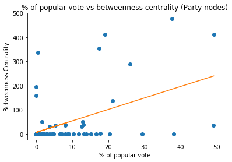

## Analysis

The network can show us a number of interesting things, like the most connected
nodes or the most important nodes. We can also look at cliques or communities of nodes
that are more connected to each other then to the rest and we can aggregate those
stats on country level. This section will briefly touch on all these things.

### Degree
The degree of a node is defined as the number of links the node has with other
nodes. In this case, we are dealing with both in degree and out degree, since
the network is directed, i.e. not every link on a page is necessarily reciprocal.
The parties in the network with the highest in degree are:

**In-Degree**
 - British National Party, United Kingdom: 48
 - Britain First, United Kingdom: 38
 - Congress of the New Right, Poland: 17
 - Tricolour Flame, Italy: 17
 - Jobbik, Hungary: 16
 - Sweden Democrats, Sweden: 16
 - Law and Justice, Poland: 15
 - Lega Nord, Italy: 14
 - Alternative for Germany, Germany: 11
 - National Democracy, Spain: 11

**Out-Degree**
 - National Front, France: 28
 - British National Party, United Kingdom: 25
 - Workers' Party, Czech Republic: 25
 - Spanish Falange of the JONS, Spain: 22
 - Britain First, United Kingdom: 19
 - Flemish Interest, Belgium: 13
 - Freedom Party of Austria, Austria: 13
 - Lega Nord, Italy: 9
 - United Kingdom Independence Party, United Kingdom: 8
 - Golden Dawn, Greece: 8

Apparently, the British National Party and Britain First (both UK) are an
important influence for other parties and movements, as a lot of pages from
other nodes link to them on their wiki. On the other hand, the French National Front
(Front National) has a lot of outgoing links to entities in our network.

If we compare this on a country level, we get the following lists:

**Average in degree per country**
- United Kingdom    28.6
- Hungary           12.0
- Sweden            10.5
- Ireland           10.0
- Austria            9.0
- Poland             8.6
- Italy              7.8
- Germany            5.5
- Switzerland        5.0
- Denmark            5.0

**Average out degree per country**
- France            28.0
- Czech Republic    25.0
- United Kingdom    17.3
- Austria           13.0
- Greece             8.0
- Belgium            7.5
- Malta              7.0
- Spain              6.5
- Italy              5.5
- Sweden             5.5

As expected, United Kingdom and France lead both these lists as well, respectively.

## Centrality

In network science, an important question is to see which nodes are the most influential?
What nodes would you need to manipulate to control the flow of information, money or
any other relation the network represents? This is called *centrality*. One way to
express this, is *betweenness centrality* it is defined as the fraction of all the
*shortest paths* from any node in the network to another pass through this specific
node. A *shortest path* in network science is defined as the way to get from node a to b
that passes the fewest other nodes. Since the flow in a network is often through these
paths, eliminating this node could bring the most damage to the network. Below, there
are two lists: one with the centrality found within the network of nationalist parties only
and one with the centrality found if we include the whole network of both parties and
fascist movements.

Top 10 Parties in terms of Betweenness Centrality among Parties
 - Law and Justice, Poland: 476.5
 - Jobbik, Hungary: 413.0
 - Fidesz, Hungary: 412.0
 - Lega Nord, Italy: 354.0
 - Tricolour Flame, Italy: 337.0
 - Freedom Party of Austria, Austria: 288.333333333
 - Congress of the New Right, Poland: 196.0
 - British National Party, United Kingdom: 159.0
 - Danish People's Party, Denmark: 136.0
 - Greater Romania Party, Romania: 51.0

 Evidently, this paints a whole different picture of what parties are important
 in the network. In my opinion it also gives a ranking that matches the idea I
 get from the political landscape in Europe and the places where nationalist parties
 have a strong presence, like Poland, Hungary and Italy.

 If we look at a similar list, but then including the fascist movements, another
 interesting phenomenon shows.

 Top 10 nodes in terms of Betweenness Centrality among all nodes
 - Jobbik, Hungary: 3283.23424354 (Party)
 - British National Party, United Kingdom: 3273.29532703 (Party)
 - Law and Justice, Poland: 2742.15454545 (Party)
 - Fidesz, Hungary: 2676.6 (Party)
 - British Union of Fascists, United Kingdom: 1732.36281166 (Movement)
 - Imperial Fascist League, United Kingdom: 1705.32739499 (Movement)
 - National Fascisti, United Kingdom: 1705.32739499 (Movement)
 - Freedom Party of Austria, Austria: 1577.89863111 (Party)
 - Lega Nord, Italy: 1423.46839631 (Party)
 - Italian Social Movement, Italy: 1422.81194141 (Movement)

 Although there are much more fascist movements in the network then nationalist
 parties (177 vs 70) and they have a higher degree on average, in terms of
 betweenness centrality, the parties still rank among the highest. An explanation
 for this could be that there are not as many links from parties to movements or
 vice versa, that the ones that do have this connection, become very important or
 central to the network.

 To verify this idea of importance within the network and provide some sort of
 validation, the betweenness centrality of the parties in the network was
 plotted against the number of votes in the last election, and there is some sort
 of trend noticeable, where the more central in the network, the more votes the party
 has.

 

## Communities

Community detection is the word often used to finding cliques or communities in
a network. Groups of nodes that belong more to each other than to the rest. Often,
this is defined as a set of nodes linking more to each other then to the rest of the network.
For community detection, the [Infomap](http://www.mapequation.org/code.html) algorithm was used.

The results of this analysis are best explored by
going up to the visualisation and use the color dropdown to mark the communities.
The largest communities are a 'fascist movement' community,
a 'nationalist party' community and a 'mixed' community. The third being the most interesting
in my opinion, because it could potentially tell something about the nature of these nationalist parties.
